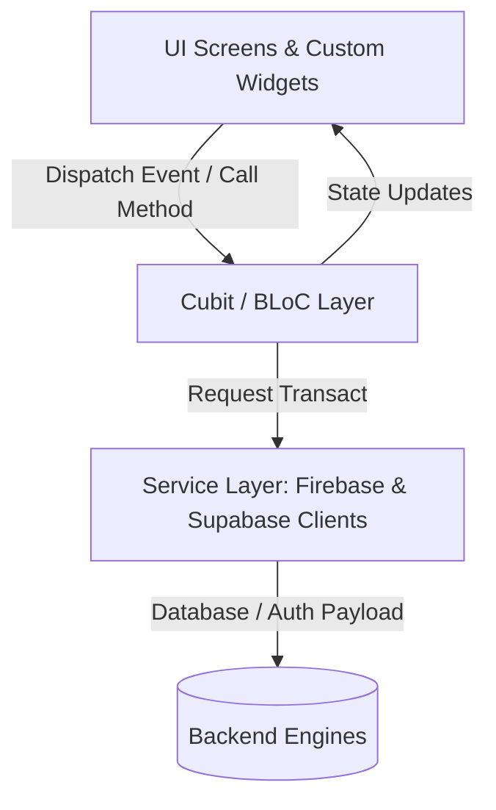
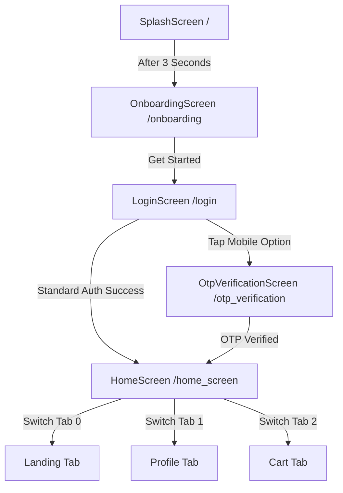
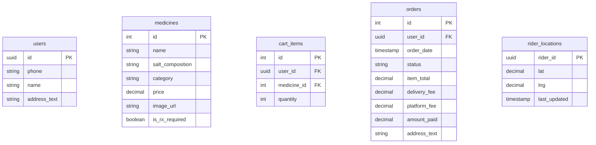

# 🏛️ QuickMed — Technical Architecture & Specification

This document details the software architecture, technical decisions, directory layout, design tokens, and state flow patterns of the QuickMed mobile application. It outlines the current hybrid backend integrations and a technical plan for transitioning mocked screens to live production API endpoints.

---

## 1. Architectural Overview

QuickMed follows a structured **BLoC/Cubit Presentation Architecture** built with the Flutter SDK. The system separates the user interface, business logic, and API/data client interactions into distinct modules.



* **Target SDK Version:** Flutter `3.22.x` / Dart `3.4.x`
* **Base Resolution Reference:** Design scales proportionally based on a **375pt** screen width (iPhone standard).

---

## 2. Tech Stack

| Operational Area | Technical Implementation | Purpose / Context |
|---|---|---|
| **Core Framework** | Flutter (`useMaterial3: true`) | Cross-platform UI compilation. |
| **State Management** | `bloc` & `flutter_bloc` | Decouples business rules from widgets. |
| **Routing & Navigation** | `go_router` | Declarative page-to-page navigation. |
| **Dual Authentication** | Firebase Auth + Supabase Auth | Hybrid authentication: Supabase handles OTP Mobile Auth, while Firebase Core runs Email/Password flows. |
| **Geolocation / Maps** | `google_maps_flutter` | Interactive route polyline and delivery driver tracking. |
| **Styling & Assets** | Custom tokens + `flutter_svg` | Theme uniformity and vector graphics rendering. |
| **Storage / Persistence** | `hydrated_bloc` *(Placeholder)* | Ready to cache screen state locally. |

---

## 3. Directory Layout

```text
lib/
├── main.dart                      # App initialization & execution hub
├── firebase_options.dart          # Firebase configuration (generated)
│
├── blocs/                         # Business Logic Controllers (Cubit / BLoC)
│   ├── home_bloc/                 # Manages active bottom-navigation indices
│   ├── landing_screen_bloc/       # Medicine inventory loading and search logic
│   ├── login_bloc/                # Controls standard email-based sign-in/up
│   ├── onboarding_cubit/          # Page slide transitions on onboarding screen
│   ├── phone_login_cubit/         # Handles Supabase OTP request cycles
│   └── splash_cubit/              # Automated delay and redirection routing
│
├── custom_components/             # Shared, themed widgets
│   ├── alert_message_box.dart     # Action-bound banner messages
│   ├── bordered_button.dart       # Secondary outlined button action
│   ├── bordered_icon_button.dart  # Icon-only outline wrapper
│   ├── bordered_textfield.dart    # Outline text input
│   ├── data_error_widget.dart     # Error/failure visual state
│   ├── floating_navbar.dart       # Pill-shaped persistent nav bottom bar
│   ├── floating_text_box.dart     # Small tags and headers
│   ├── gradient_button.dart       # Primary CTA button with brand gradients
│   ├── loading_indicator.dart     # Loading spinners
│   ├── suffix_action_text_field.dart # Search bar with custom action trigger
│   ├── themed_card.dart           # Grid card representation of medicines
│   ├── themed_floating_button.dart # Custom FAB styles
│   └── themed_text_field.dart     # Material-filled inputs
│
├── screens/                       # User interfaces
│   ├── splash_screen.dart         # Intro logo screen
│   ├── onboarding_screen.dart     # Features slides screen
│   ├── home_screen.dart           # Navigation container shell
│   ├── landing_screen.dart        # Store, categories, and main grids
│   ├── search_screen.dart         # Salt-level product search screen
│   ├── cart/                      # Cart checkout screen & custom selectors
│   ├── login/                     # Phone login inputs & OTP verification pages
│   └── profile/                   # User profile stats and past orders sheet
│
├── services/                      # API wrappers and tokens
│   ├── app_colors.dart            # Theme color definitions (Standard)
│   ├── app_text_styles.dart       # Font parameters and weights (Standard)
│   ├── auth.dart                  # Firebase Authentication helper client
│   ├── enum.dart                  # Global Status enumeration
│   ├── router.dart                # Declarative routes list mapping
│   ├── strings.dart               # Consolidated UI display copy strings
│   ├── supabase_config.dart       # Supabase URL and anon credentials
│   ├── supabase_service.dart      # Client instantiation for Supabase
│   ├── text_styles.dart           # Sizing-aware TextStyle wrapper (Legacy)
│   └── theme_colours.dart         # Custom RGB brand colors (Legacy)
│
└── utils/
    └── screen_size.dart           # Context scaling extensions for fonts & spacing
```

---

## 4. Application Flow & Routing

Navigation is configured via GoRouter inside [router.dart](file:///Users/pranjalgaur/development/Flutter_projects/quick_med_mobile_app-main/lib/services/router.dart). The core execution pathway flows as follows:



*Note: Tabs inside the `HomeScreen` are run within a `TabBarView` bound directly to a `HomeBloc` rather than sub-GoRoutes.*

---

## 5. Detailed State Management Specifications

### 5.1 LoginBloc (`blocs/login_bloc/`)
* **Purpose:** Handles email/password sign-in and sign-up states.
* **Fields:** `email`, `pswd`, `loginResponseStatus (Status)`, `errorMsg`, `userLogin (bool)`, `userLoginType (UserLogin)`, `loginSuccess`.
* **State Updates:** Dispatches `SignUpEvent` calling the Firebase auth client. Switches panel types based on validation callbacks.

### 5.2 PhoneLoginCubit (`blocs/phone_login_cubit/`)
* **Purpose:** Triggers mobile phone OTP requests using Supabase Auth.
* **Fields:** `PhoneLoginInitial`, `PhoneLoginLoading`, `PhoneLoginSuccess`, `PhoneLoginFailure(error)`.
* **Operations:** Standardizes the local phone string (e.g. appends `+91` prefix if missing) and submits `auth.signInWithOtp`.

### 5.3 LandingScreenBloc (`blocs/landing_screen_bloc/`)
* **Purpose:** Fetches the medicine inventory catalog and performs inline filtering.
* **Fields:** `medicineDataResponseStatus (Status)`, `medicineList`, `filteredList`, `error`.
* **Details:** Currently models 30 randomly compiled medicines upon loading, cycling through common medications (Azithromycin, Paracetamol, Levocetirizine).

### 5.4 OnboardingCubit (`blocs/onboarding_cubit/`)
* **Purpose:** Keeps track of the active slide index during onboarding.
* **Fields:** `OnboardingState` containing `currentPage (int)`.

---

## 6. Sizing Scaling & Design Tokens

### Responsive Layout Sizing
QuickMed enforces responsive text scaling and screen dimension margins to preserve the layout regardless of the user's screen size. This is handled by [screen_size.dart](file:///Users/pranjalgaur/development/Flutter_projects/quick_med_mobile_app-main/lib/utils/screen_size.dart):
* `14.fs` or `context.fs(14)` adjusts the raw design font size based on the ratio of screen width to the 375pt mockup width.
* `context.sw` and `context.sh` allow sizing container heights/widths relative to the screen width and height.

### Color Tokens
* **Standard Colors:** [app_colors.dart](file:///Users/pranjalgaur/development/Flutter_projects/quick_med_mobile_app-main/lib/services/app_colors.dart) provides high-level color tokens like `AppColors.primary`, `AppColors.textPrimary`, `AppColors.error`, etc.
* **Specific Theme Colors:** [theme_colours.dart](file:///Users/pranjalgaur/development/Flutter_projects/quick_med_mobile_app-main/lib/services/theme_colours.dart) provides raw brand colors like `ThemeColours.lightGreen`, `ThemeColours.darkGreen`, `ThemeColours.lightOrange`, etc.

---

## 7. Migration Plan: Mock State to Production Backend

To move from the current UI-mocked state to a production backend, the following steps are required:

### Step 1: Centralize Cart State (`CartCubit`)
* **Problem:** Currently, the cart uses local `setState` within the [cart/](file:///Users/pranjalgaur/development/Flutter_projects/quick_med_mobile_app-main/lib/screens/cart) directory. "Add to Cart" buttons on the landing screen do not sync with this state.
* **Solution:** 
  1. Create a `CartCubit` that keeps track of added items.
  2. Provide the `CartCubit` at the root of `MyApp` so it is accessible from both `LandingScreen` and `CartScreen`.
  3. Wire the "Add to Cart" callbacks on the landing screen to emit add actions to the `CartCubit`.

### Step 2: Database Schema (Supabase)
To support live data, we need the following tables in the Supabase database:



### Step 3: Stream Live GPS Coordinates for Tracking
* Replace the local simulation timer in `CartScreen` with a query mapping to `rider_locations`.
* Set up a real-time listener subscription (using Supabase Realtime or Firestore Streams):
  ```dart
  Supabase.instance.client
      .from('rider_locations')
      .stream(primaryKey: ['rider_id'])
      .eq('rider_id', activeRiderId)
      .listen((data) {
        // Update marker position and animate Google Map camera.
      });
  ```
